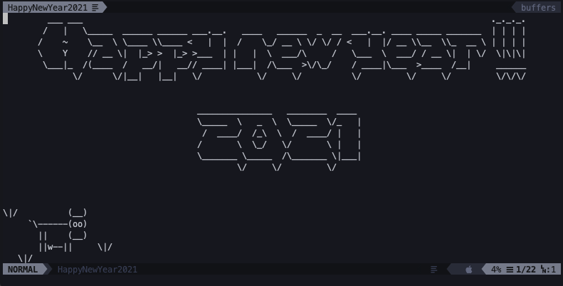
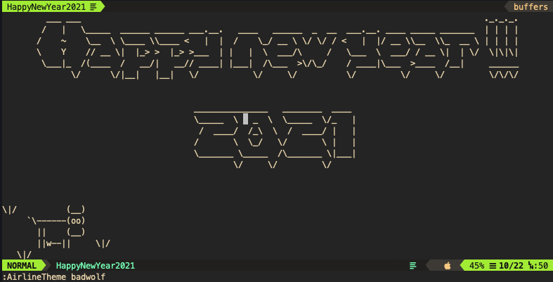

# Vim年賀状

これはVimで年賀状を作るためのリポジトリです

## Vimで年賀状を作るためのメモ

- itermのwindow size `112*25`
- 実行コマンド `vim HappyNewYear2021 -c "set nonumber | set showmode | set ft=HappyNewYear"`
- 実行コマンド `vim -N -u HappyNewYear2021.vim`

## スクリーンショット

### iceberg

### gruvbox and badwolf (airline theme)

## 参考文献

- http://instinct.org/cows/ascii-cows1.html
- https://patorjk.com/software/taag/#p=display&f=Graffiti&t=Type%20Something%20
- https://orgachem.hatenablog.com/entry/2013/12/19/130701
- https://www.asciiart.eu/animals/cows
